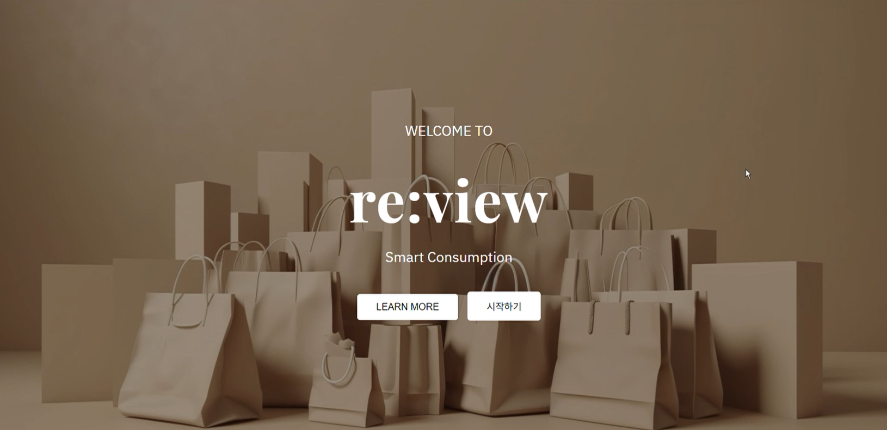

# 🔍 re:view - AI 기반 광고성 리뷰 탐지 서비스 ✨

[](https://reactjs.org/) 
[](https://www.java.com/) 
[](https://www.python.org/) 
[](https://fastapi.tiangolo.com/) 
[](https://www.mysql.com/)  

## 📖 프로젝트 소개
소비자는 제품 구매 전 리뷰를 주요 판단 기준으로 삼지만,  
**광고성 리뷰의 확산**으로 인해 리뷰 신뢰도가 낮아지는 문제가 있습니다.  
이를 해결하기 위해 AI를 활용하여 리뷰의 **진위 여부를 자동 판별**하는 시스템을 개발하였습니다.

---

## 🖼️ 시연 영상 및 이미지
<p align="left">
   <a href="https://youtu.be/HhGPVoTFN2Y?si=pCXGb2kFzzdIu_g-">
      
   </a>
</p>

> 📥 **[Download MP4 (GitHub Release)](https://github.com/eun903/adReviewDetermine/releases)**

---

## ⚙️ 기술 스택
| 구분 | 사용 기술 |
|------|------------|
| **Frontend** | React, Recharts (데이터 시각화) |
| **Backend** | Spring Boot, Spring Security (JWT), Spring Data JPA |
| **AI Server** | FastAPI, Python, Sentence-Transformers (all-MiniLM-L6-v2) |
| **LLM / OCR** | Google Gemini API, Tesseract OCR |
| **Database** | MySQL |

---

## 🧩 시스템 아키텍처 및 흐름도

### **System Architecture**
```text
[React Client] <───(JWT Auth)───> [Spring Boot Server] <───(REST API)───> [FastAPI AI Engine]
                                         │                                     │
                                   [MySQL DB]                          [Fine-tuned Model]
```

---

### 🔍 유사도 분석 과정
1. **데이터 수집**
   - 광고성 리뷰 800개, 비광고성 리뷰 567개 수집
3. **모델 사용**
   - `SentenceTransformer: all-MiniLM-L6-v2` 
5. **파인튜닝 & 문장 임베딩**
   - 광고성끼리 가깝게, 비광고성끼리 가깝게 학습
   - 광고성과 비광고성끼리는 멀게 학습
   - 리뷰를 384차원 벡터로 변환
7. **키워드 가중치 적용**
   - 광고 관련 단어에 +가중치, 비광고 관련 단어에 -가중치 적용
9. **통계 분석**
    - `p-value < 0.001`, `Cohen's d`를 통해 그룹간 차이 검증

---

### 데이터 수집 및 서비스 정책

1. 사용자 주도 분석 (User-Centric Analysis)

 서비스의 핵심 로직을 외부 플랫폼 크롤링이 아닌, 사용자가 직접 제공한 데이터(텍스트/이미지) 기반으로 설계하여 데이터 활용의 정당성을 확보하고 법적 리스크를 최소화하였습니다.

2. 리스크 관리 및 데이터 마스킹 (Risk Management)

 외부 플랫폼 연동 시 발생할 수 있는 운영 정책 이슈를 고려하여, 외부 데이터는 핵심 지표(유사도 %) 위주로만 제공하며 세부 리뷰 내용은 익명화(Masking) 처리를 통해 정보 노출을 최소화하였습니다.

3. 확장성 고려 (Future Scalability)

 향후 플랫폼별 공식 API 제휴 또는 사용자 권한 위임 기반의 데이터 접근 방식을 고려한 아키텍처 설계를 마쳤으며, 정책 변화에 따라 유연하게 대응할 수 있도록 구조화하였습니다.

---

📊 **결과 요약**
- 분석 결과, 광고성 리뷰 그룹은 특정 어휘 패턴과 문체 구조에서 매우 높은 **유사도**를 보임을 확인하였습니다.
- 반면, 실제 소비자 리뷰 그룹은 개인별 주관적 표현으로 인해 **문장 임베딩 공간 내에서의 분산도가 높게**나타나는 특징을 보였습니다.
- 모델 파인튜닝 및 가중치 로직 적용 후, 두 그룹 간의 차이를 'p-value < 0.001' 수준에서 검증함으로써 **통계적으로 유의미하고 신뢰도 높은 판별 지표**를 구축하였습니다.
---

 ### 📈 프로젝트 성과
  - 대조학습 기반 파인튜닝과 가중치 보정 로직을 통해 탐지 정확도를 **기존 대비 45% 개선**하였습니다.
  - 분석 결과에 Gemini 2.0 기반의 핵심 요약 기능을 통합하여, 사용자가 방대한 리뷰 내용을 **직관적으로 파악할 수 있도록 UX를 개선**하였습니다.
  - AI 추론 엔진(FastAPI)과 메인 서버(Spring Boot), 그리고 시각화 대시보드를 유기적으로 연결하여 **데이터 수집부터 분석, 시각화까지의 전 과정을 원스톱 서비스로 구현** 하였습니다.
